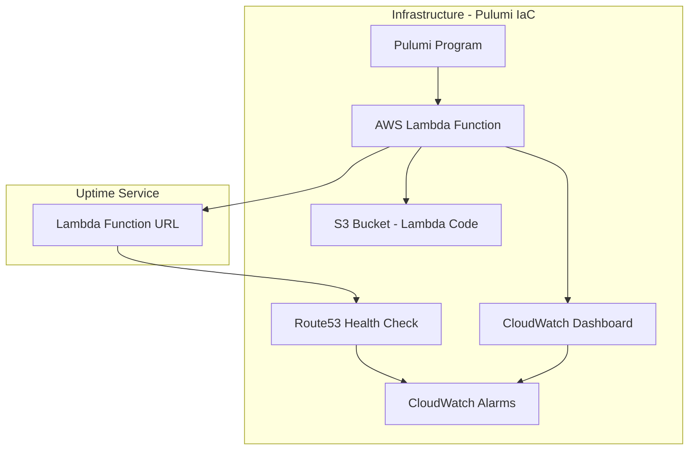

# Uptime Service Monorepo

This project contains all the code and configuration required to deploy an uptime service on AWS using Pulumi. The service monitors an AWS Lambda function. Its performance and health are tracked via CloudWatch metrics, dashboards, and Route53 health checks. The project is set up as a monorepo to manage the uptime service and its dependencies in one place.

## What Are We Trying to Do?

Our goal is to ensure that the critical Lambda service remains available and responsive. We accomplish this by:

- **Deploying an AWS Lambda function** that performs our uptime check.
- **Exposing the Lambda via a Function URL** for public access.
- **Monitoring the Lambda's health** by checking for expected responses (e.g., 200 OK) using Route53 health checks.
- **Aggregating and visualizing metrics** on a CloudWatch dashboard (including invocations, durations, errors, and success rate).
- **Setting up CloudWatch alarms** that alert us if the service becomes unhealthy.

This setup allows SRE teams to have a clear and immediate overview of service reliability and performance.

## Architecture Diagram

The following Mermaid diagram illustrates the high-level architecture and dependencies managed by this project:



## Requirements

- **Pulumi** – for managing infrastructure as code.
- **Python 3.8+** – the runtime environment.
- **AWS CLI** – configured with appropriate credentials.
- **Access to an AWS Account** – to provision the resources.

## Setup and Deployment

1. **Install Pulumi and Python Dependencies**

Make sure you have Pulumi installed and configured on your machine. Then, install the necessary Python packages:

```sh
pip install pulumi pulumi_aws
```

2. **Configure Pulumi**

Update your Pulumi configuration file (`Pulumi.yaml` and `Pulumi.prod.yaml`) with the correct AWS region and stack details.

```sh
pulumi config set region us-east-1
```

3. **Deploy the Stack**

Run the following command to deploy your infrastructure:

```sh
pulumi up
```

   Confirm the changes, and Pulumi will provision the Lambda function, S3 bucket, CloudWatch dashboard, and all associated resources.

## Golden Signals

To ensure our service remains reliable and performant, we monitor the four golden signals of SRE:

- **Latency:**  
  Measures how long it takes to process a request. This helps us understand how quickly the system responds.

- **Traffic:**  
  Captures the volume of requests. This indicates how much load the system is handling.

- **Errors:**  
  Tracks the rate of failed requests. A spike in errors can signal issues that require immediate attention.

- **Saturation:**  
  Reflects resource usage (like concurrent executions). High saturation may indicate that the system is nearing its capacity limits.

These metrics provide a clear, quick overview of system health, enabling early detection of issues.

## How It Works

- **AWS Lambda Function:**  
  The Lambda function (defined in `lambda/index.py`) first checks for the required `BUCKET_NAME` environment variable. It then attempts to access the specified S3 bucket. If the bucket is unreachable due to permission issues or other errors, the function fails. If the bucket is accessible, it counts the objects (even if empty) and returns a `200` response that includes the bucket name and the object count.

- **Function URL:**  
  The Lambda function is exposed via a Function URL, making it publicly accessible for health checks.

- **Route53 Health Check:**  
  Configured to run every 10 seconds, the Route53 health check pings the Lambda Function URL and verifies that a healthy `200` response is returned. Any deviation triggers a check failure.

- **CloudWatch Metrics and Dashboard:**  
  Metrics such as total invocations (Traffic: Total Requests), average latency (Latency: Average Duration), error rate (Errors: Error Rate (%)), and concurrent executions (Saturation: Concurrent Executions) are aggregated and visualized on a CloudWatch dashboard. This dashboard is designed with SRE metrics in mind and follows the golden signals approach to provide a comprehensive view of system performance and reliability.

- **CloudWatch Alarms:**  
  An alarm is configured using metric math to monitor the Lambda function’s error rate. It calculates the error rate as `(Errors / Invocations) * 100` and triggers if this rate exceeds 0.1% for two consecutive evaluation periods. This ensures that any significant service degradation is promptly detected, triggering immediate SRE action.
