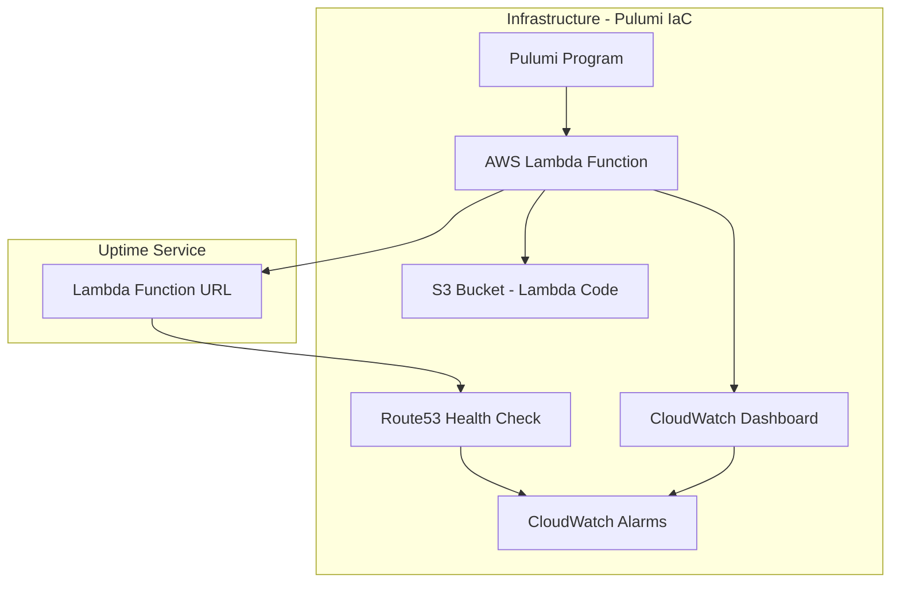

# Uptime Service Monorepo

This project contains all the code and configuration required to deploy an uptime service on AWS using Pulumi. The service monitors an AWS Lambda function—its performance and health are tracked via CloudWatch metrics, dashboards, and Route53 health checks. The project is set up as a monorepo to manage the uptime service and its dependencies in one place.

## What Are We Trying to Do?

Our goal is to ensure that the critical Lambda service remains available and responsive. We accomplish this by:

- **Deploying an AWS Lambda function** that performs our uptime check.
- **Exposing the Lambda via a Function URL** for public access.
- **Monitoring the Lambda's health** by checking for expected responses (e.g., 200 OK) using Route53 health checks.
- **Aggregating and visualizing metrics** on a CloudWatch dashboard (including invocations, durations, errors, and success rate).
- **Setting up CloudWatch alarms** that alert us if the service becomes unhealthy.

This setup allows SRE teams to have a clear and immediate overview of service reliability and performance.

## Architecture Diagram

The following Mermaid diagram illustrates the high-level architecture and dependencies managed by this project:



## Requirements

- **Pulumi** – for managing infrastructure as code.
- **Python 3.8+** – the runtime environment.
- **AWS CLI** – configured with appropriate credentials.
- **Access to an AWS Account** – to provision the resources.

## Setup and Deployment

1. **Install Pulumi and Python Dependencies**

   Make sure you have Pulumi installed and configured on your machine. Then, install the necessary Python packages:

```sh
pip install pulumi pulumi_aws
```sh

2. **Configure Pulumi**

   Update your Pulumi configuration file (`Pulumi.yaml` and `Pulumi.prod.yaml`) with the correct AWS region and stack details.
   
```sh
pulumi config set region us-east-1
```sh

3. **Deploy the Stack**

   Run the following command to deploy your infrastructure:
   
```sh
pulumi up
```sh

   Confirm the changes, and Pulumi will provision the Lambda function, S3 bucket, CloudWatch dashboard, and all associated resources.

## How It Works

- **AWS Lambda Function:**  
  The Lambda function (defined in `app/index.py`) returns a 200 response when the required `BUCKET_NAME` environment variable is present. If missing, it raises an error (or returns a non-200 response as needed).

- **Function URL:**  
  The Lambda function is exposed via a Function URL, making it publicly accessible for health checks.

- **Route53 Health Check:**  
  Configured to run every 10 seconds, the Route53 health check pings the Lambda Function URL and checks for a healthy (200) response. If the response is below 200, the check fails.

- **CloudWatch Metrics and Dashboard:**  
  Metrics such as invocations, duration (both average and p95), errors, and throttles are aggregated and visualized on a CloudWatch dashboard. This dashboard is designed with SRE metrics in mind.

- **CloudWatch Alarms:**  
  Alarms are set up on both Lambda errors and Route53 health check failures. This ensures that any downtime or service degradation triggers immediate alerts for SRE action.

